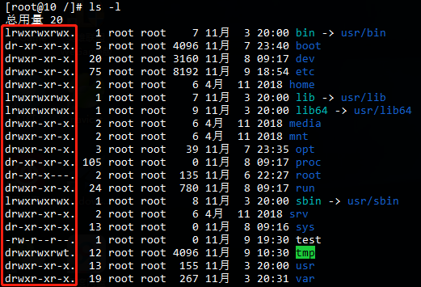
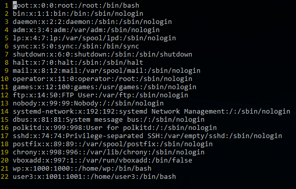
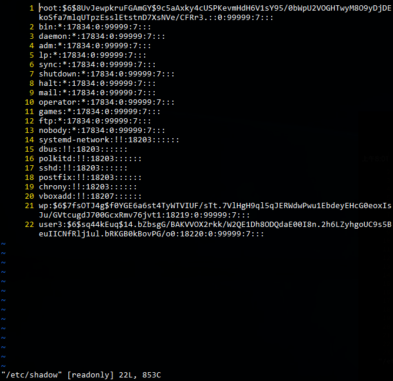
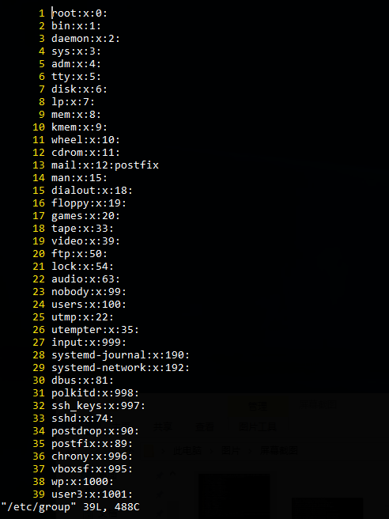
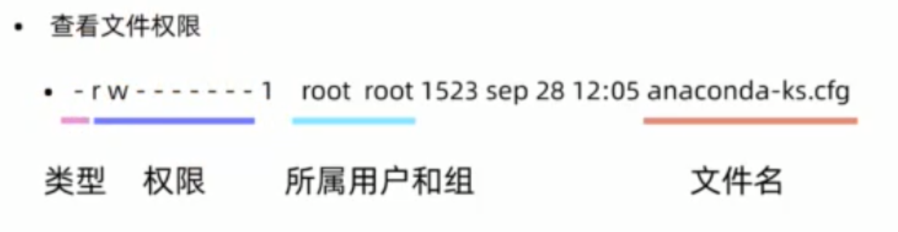
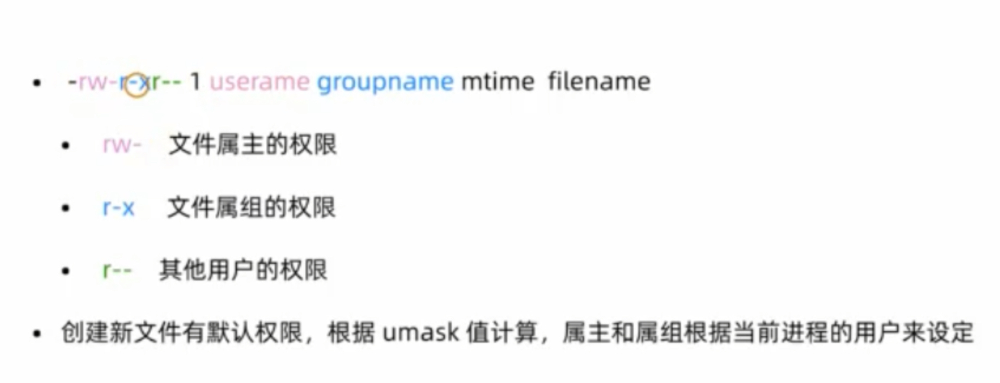
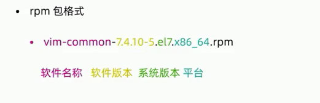
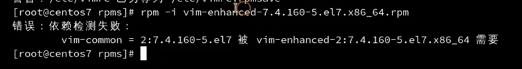
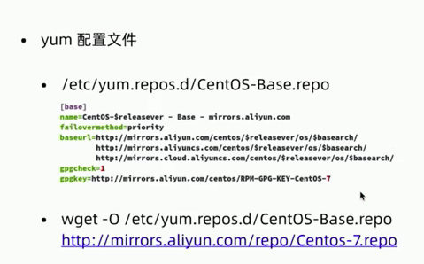
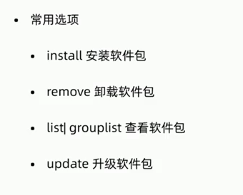

# Linux

## 常用目录介绍
* `/` 根目录
* `/root root`用户的家目录
* `/home/username` 普通用户的家目录
* `/etc` 配置文件的目录(对应windows的注册表)
* `/bin` 命令目录
* `/sbin` 管理命令目录
* `/usr/bin/user/sbin` 系统预装的其他命令

关机命令：init 0

## 万能的帮助命令
* `man`
是 `manual`的缩写，eg: `# man ls`
`man`也是一条命令，分为9章，可以使用`man man`命令获得`man`的帮助
* `help`
shell（命令解释器）自带的命令成为内部命令，其他的是外部命令
 内部命令使用help帮助
 `# help cd`
 外部命令使用help帮助
 `ls --help`
 (判断内部命令还是外部命令可以通过 type xxx，eg: `type ls type cd`)
 所以我们使用`man cd`也能得到解释文档，但那是`shell`的解释文档，因为`cd`是`shell`的内置命令，所以查看`cd`的命令需要`help cd`
* `info`
`info` 比 `help` 更详细，作为 `help` 的补充

## 文件查看
* `pwd` 显示当前的目录名称
* `cd` 切换目录
* `ls` 查看当前目录下的文件
  ###### 常见参数
  - -l 长格式显示文件
  - -a 显示隐藏文件
  - -r 逆序显示(配合-l属性使用，默认逆序显示名称)
    - `ls -l -r`  `ls -l -r -t`（同时也可以合并命令 `ls -lrt`）
  - `-h` 自动格式化大小（e.g. 36M, 8G）
  - -t 安装时间顺序显示
  - -R 递归显示

当输入 `ls -l`命令时：

### 第一列
显示名称颜色不一致表示文件权限不一样。
红框前面的**第一个字符**表示文件类型，有以下几种：
* `-` 普通文件
* `d` 目录
* `l` 符号链接
* `s` 套接字（伪文件）
* `b` 块设备（伪文件）
* `c` 字符设备（伪文件）
* `p` 管道（伪文件）
> 占用存储空间的类型：文件、目录、符号链接。符号链接记录的是路径，路径不长时存在innode里面。其他四种：套接字、块设备、字符设备、管道是伪文件，不占用磁盘空间。

剩下的**七个字符**表示权限的意思，会在权限部分说明

### 第二列
包含的文件个数

### 第三列
哪个用户创建的文件

### 第四列
用户属于哪个用户组

### 第五列
当前文件的大小

### 第六列
文件的最后修改时间

### 第七列
文件/文件夹的名称

## cp
> 复制命令

* `-r` 复制目录(默认只能复制文件，想要复制带文件夹需要加上`-r`，例如：`cp -r /root/a /tmp`)
* `-v` 复制的时候显示进度条
* `-p` 保留文件的用户、权限、时间等属性
* `-a` 复制的文件保留时间，属主，权限

## mv
> 移动、重命名文件或者文件夹

## 文本查看命令
* `cat` 文本内容显示到终端
* `head` 查看文件开头
  * -5 查看前五行(默认前10行)
* `tail` 查看文件结尾
  * -5 查看后五行(默认后10行)
  * 常用参数`-f`文件内容更新后，显示信息同步更新（查看日志）
* `wc` 统计文件内容信息
  * `-l`
* `more` 分行显示
* `less` 分行显示

## 打包和压缩
### 压缩
#### Linux的备份压缩
> 最早的Linux备份介质是磁带，使用的命令是`tar`
> 可以打包后的磁带文件进行压缩存储，压缩的命令是gzip和bzip2
> 经常使用的扩展名是 ".tar.gz" ".tar.bz2" ".tgz"

#### tar 打包命令
* c 打包
* x 解包
* f 指定操作类型为文件
* z 压缩文件
* v 把操作过的文件列出来

#### .tar
解包：`tar zxvf FileName.tar`
打包：`tar czvf FileName.tar DirName`

#### .gz
解压1：`gunzip FileName.gz`
解压2：`gzip -d FileName.gz`
压缩：`gzip FileName`

#### .tar.gz 和 .tgz
解压：`tar zxvf FileName.tar.gz`
压缩：`tar zcvf FileName.tar.gz DirName`
压缩多个文件：`tar zcvf FileName.tar.gz DirName1 DirName2 DirName3 ...`

#### .bz2
解压1：`bzip2 -d FileName.bz2`
解压2：`bunzip2 FileName.bz2`
压缩： `bzip2 -z FileName`

#### .tar.bz2
解压：`tar jxvf FileName.tar.bz2`
压缩：`tar jcvf FileName.tar.bz2 DirName`

#### bz命令
解压1：`bzip2 -d FileName.bz`
解压2：`bunzip2 FileName.bz`
压缩：未知

#### .tar.bz
解压：`tar jxvf FileName.tar.bz`

#### Z命令
解压：`uncompress FileName.Z`
压缩：`compress FileName`

#### .tar.Z
解压：`tar Zxvf FileName.tar.Z`
压缩：`tar Zcvf FileName.tar.Z DirName`

#### zip命令
解压：`unzip FileName.zip`
压缩：`zip -r FileName.zip DirName`

## 用户管理常用命令
* `useradd` 新建用户
* `userdel` 删除用户
 * `-r` 删除家目录里面数据
* `passwd` 修改密码
* `usermod` 修改用户属性（比如更改用户家目录）
* `chage` 修改用户属性（更新用户密码过期信息）
* `id <name>` 新建用户之后，可以通过`id`命令查看，不加 `<name>`表示查看当前用户

## 组管理命令
* `groupadd` 新建用户组
  * 用户加入用户组（第一种方式）：
    * `useradd user1`
    * `groupadd group1`
    * `usermod -g group1 user1`
  * 用户加入用户组（第二种方式）：
    * `useradd -g group1 user2`
* `groupdel` 删除用户组

## su和sudo
* su 切换用户
  * `su - <user>` 切换用户(可以通过`exit`退出，`-`可以不写)
* sudo 以其他用户身份执行命令
  * visudo 设置需要使用sudo的用户（组）

## 用户和用户组配置文件
`vi /etc/passwd`

第一列 | 第二列 | 第三列 | 第四列 | 第五列 | 第六列
----|-----|-----|-----|-----|----
用户名 | 用户是否需要密码进行验证 | uid(用户ID，区分不同用户，如果用户相同，取uid最小的。root的uid为0，如果在后面哪个用户更改了uid为0，那么它将是 root用户。uid一般不做更改，否则系统账号会紊乱。) | gid(用户组ID，同上) | 用户家目录 | 命令解释器目录(如果设置`/sbin/nologin` 将无法登录)

`vi /etc/shadow`

第一列  第二列
用户名   密码($6$开头，并已加密，即使相同密码也会加密成不同字符串)

`vi /etc/group`

第一列 | 第二列 | 第三列 | 第四列
----|-----|-----|----
用户组名 | 用户组是否需要密码进行验证 | gid | 其他组（如第13行表示mail组里面包含其他用户postfix）
> 根据`id postfix`对比其他用户可以看出，postfix 用户即属于 postfix 组，也属于 mail组

## 文件与目录权限的表示方法

### 文件类型
* `-` 普通文件
* `d` 目录文件
* `b` 块特殊文件（比如：移动硬盘）
* `c` 字符特殊文件
* `l` 符号链接（windows中的快捷方式）
* `f` 命令管道
* `s` 套接字文件

#### 文件字符权限表示方法
* `r` 读
* `w` 写
* `x` 执行

#### 目录权限的表示方法
* `x` 进入目录
* `rx` 显示目录内的文件名
* `wx` 修改目录内的文件名

### 数字权限的表示方法
* r = 4
* w = 2
* x = 1

#### 文件权限的表示方法

### 修改权限命令
> u 表示属主的权限，即上图中粉色的部分，g 表示属组的权限，即蓝色的部分，o 表示其他用户的权限，即绿色的部分，a 表示一起修改
* `chmod` 修改文件、目录权限
  * `chmod u+x /tmp/testfile`（`u+x` 表示给属主添加执行权限，`u-x` 表示给属主减少执行权限，`u=rwx` 表示属主添加读写执行的权限）
  * `chmod 755 /tmp/testfile`
* `chown` 更改属主、属组（eg：`chown user1 /test`）
* `chgrp` 可以单独更改属组（不常用）（eg：`chgrp user1 /test`）

## 软件安装
#### 软件包管理
> 包管理器是方便软件安装、卸载，解决软件依赖关系的重要工具
* CentOS、RedHat 使用 yum 包管理器，软件安装包格式为 rpm
* Debian、Ubuntu 使用 apt 包管理 、软件安装包格式为 deb
#### rpm包和rpm命令
> redhat 系统中包管理器叫 rpm包，管理命令叫 rpm 命令

**rpm 命令常用参数**
> 查询和卸载的时候，只需要写名字即可，如：`rpm -q vim-common`，但是添加的时候要写全名字版本号等等，如：`rpm -i vim-enhanced-7.4.160-.el7.x86_64.rpm`
* -q 查询软件包(`rpm -qa` 显示全部，`rpm -qa | more` 分屏显示，-l 显示安装目录)
* -i 安装软件包
* -e 卸载软件包

**使用rpm可能出现的两个问题**
* 依赖问题

这样依赖的关系，我们要先安装它依赖的包。如果一个包的依赖树过于大的时候，会给我们按照造成很大的困扰。所有要用 [yum仓库](#yum仓库) 解决包裹依赖的问题
* 版本问题
假如现有版本和当前系统不兼容，那么就要采取 [源代码编译安装](#源代码编译安装) 的方式
#### yum仓库
> 对包集中管理的仓库

**CentOS yum 源**
http://mirror.centos.org/centos/7/
**国内镜像**
https://opsx.alibaba.com/mirror

推荐使用上面第二条，别人已经写好的配置文件，下载下来后直接覆盖本地即可
##### yum 常见命令

**问题**
如果源代码更新了，但是没有作者没有上传至yum仓库，怎么办？
答：可以通过[源代码编译安装](#源代码编译安装) 的方式

#### 源代码编译安装
> 除了rpm包安装，还有源代码编译安装（以下是通用的安装编译步骤，具体以库的readme为准）
* wget [https://openresty.org/download/openresty-1.15.8.1.tar.gz](https://openresty.org/download/openresty-1.15.8.1.tar.gz)
* tar -zxf openresty-<VERSION>.tar.gz
* cd openresty-<VERSION>
* ./configure --prefix=/usr/local/openresty（指定安装目录）
* make -j2（-j2 用两个逻辑的CPU编译，加快一些）
* make install

