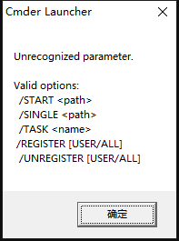
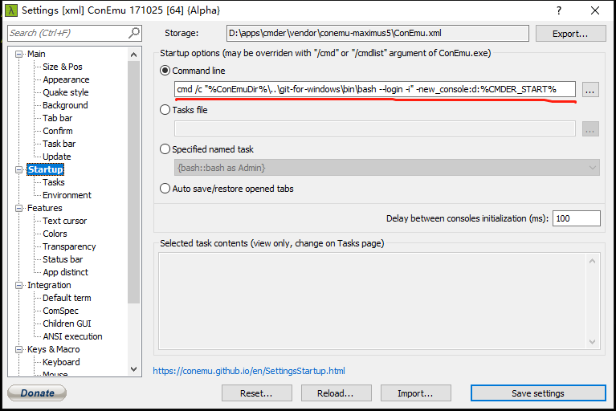

# Cmder here 无法进入当前目录
> Cmder是一个用于替换windows自带的cmd的，包含各种软件包（比如 git）并且非常好用的终端模拟器。

cmder 的创建安装和配置，这里不做过多介绍，网上一搜一大把，本文解决 win10下Cmder调用bash怎样设置右键跳转到当前目录？

网上大部分的搜索结果是：`cmder /register all（Cmder.exe /REGISTER ALL）`，但是我遇到的报错信息如下：

解决方法：
将setting - startup - Command line设置成如下：
`cmd /c "%ConEmuDir%\..\git-for-windows\bin\bash --login -i" -new_console:d:%CMDER_START%`

文章参考至：https://www.zhihu.com/question/56937511/answer/216234014

