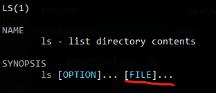

## Linux 命令随记(共有特性)
locale 查看当前系统的语言

\# 表示root用户，不受到任何权限限制

当使用`man`命令查看帮助时，如果命令名称后面是...，表示可以支持多个文件，如：`man ls`，则表示可以支持多个文件

例如：

`/tmp`根目录下的临时目录

通配符:
* `*`表示符合前置条件所有文件，或者有`fileA123``fileB``fileC`这三个文件，可以使用`cp -v file* /`
* `?`表示符合前置条件且结尾只有一个文件满足`*`的所有文件，或者有`fileA123``fileB``fileC`这三个文件，可以使用`ls flie?`就会显示`fileB``fileC`

`shutdown -h 30` 30分钟后执行关机
`shutdown -c` 取消关机

