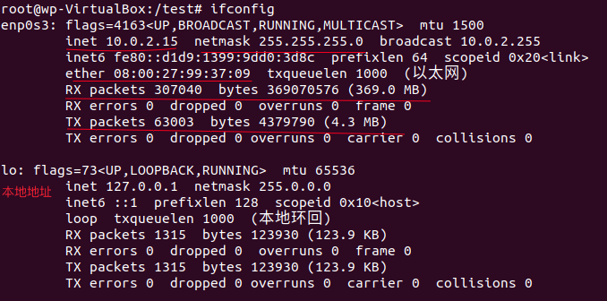
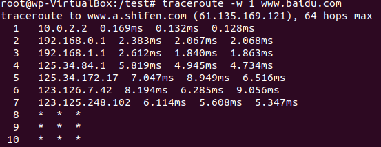
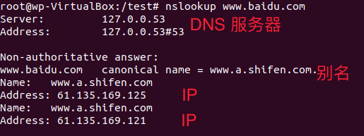
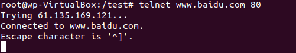
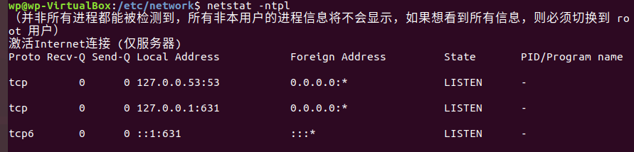

## 网络管理

### 网络状态查看
常见的网络管理包有两个 net-tools 和 iproute
###### net-tools
* ifconfig
  - eth0 第一块网卡（网络接口）
  - 你的第一哥网络接口可能叫做下面的名字
    - en01 板载网卡
    - ens33 PCI-E 网卡
    - enp0s3 无法获取物理信息的PCI-E网卡
    - CentOS7 使用了一致性的网络设备命名，以上都不匹配使用 eth0
* route
  * 查看网关
    - `route -n`
  * 添加网关
    * `route add default gw <网关ip>`
    * `route add -host <指定ip> gw <网关ip>`
    * `route add -net <指定网段> netmask <子网掩码> gw <网关ip>`
      - 例如：`route add -net 192.168.0.0 netmask 255.255.255.0 gw 10.211.55.3`
  * 删除网关
    * `route del default gw <网关ip>`
* netstat
  见下 网络故障排除
> 如下红线部分分别是 IP地址、子网掩码、MAC地址、RX发出的包的信息、TX接收包的信息

###### iproute2
* ip（对应ifconfig的命令）
  * `ip addr ls`
  - `ifconfig`
  * ip link set dev eth0 up
  - ifup eth0
  * ip addr add 10.0.0.1/24 dev eth1
  - ifconfig eth1 10.0.0.1 netmask 255.255.255.0
  * ip route add 10.0.0/24 via 192.168.0.1
  - route add -net 10.0.0.0 netmask 255.255.255.0 gw 192.168.0.1
* ss
  - 见下 网络故障排除

### 网络配置
* `ifconfig <接口> <ip地址> [netmask <子网掩码>]`
* `ifup <接口>` 启用网卡
* `ifdown <接口>` 禁用网卡
##### 网络接口命名修改
> 问：为啥修改命名？
答：当大批量管理linux系统的时候，批量对网卡做操作的时候，需要统一名称
* 网卡命名规则受`biosdevname`和`net.ifnames`两个参数影响
* 编辑`/etc/default/grub`文件，增加`biosdevname=0 net.ifnames=0`
* 更新 grub
  - \# grub2-mkconfig -o /boot/grub2/grubcfg
* 重启
  * \# reboot

  |  | biosdevname | net.ifnames | 网卡名
  |---|-------------|-------------|----
  | 默认 | 0 | 1 | ens33
  | 组合1 | 1 | 0 | em1
  | 组合2 | 0 | 0 | eth0

### 网络故障排除
* ping 检测当前主机和目标主机是否能联通，不能连通可能是网络故障或者目标机器的防火墙设置
* traceroute 追踪路由，查看路由的每次跳转 `traceroute -w 1 www.baidu.com` 链接超时最多等待1秒钟（下图中*表示该主机不支持 traceroute）

* mtr 检测到目标是否有数据包丢失

* nslookup

* telnet
`telnet www.baidu.com 80`，下图表示可以连通
> 退出 telnet 链接可以使用 ctrl + }， 然后输入 quit， 退出

* tcpdump 细致分析数据包 抓包
`tcpdump -i any -n port 80` 表示抓取通过网卡的任意数据包(-i any)的80端口(port 80)，且如果是域名的话转换为IP的形式展示(-n)
`tcpdump -i any -n host 10.0.0.1` 抓取到主机10.0.0.1的数据包
`tcpdump -i any -n host 10.0.0.1` and port 80 抓取到主机10.0.0.1端口80的数据包
`tcpdump -i any -n host 10.0.0.1` and port 80 -w /tmp/filename 抓取到主机10.0.0.1端口80的数据包并存储到 /tmp/filename 中
* netstat
查看主机上的服务开启的端口以及对应的状态
`netstat -ntpl` n表示以IP形式展示，t表示展示TCP链接，p端口对应的进程展示，l表示listen监听

* ss
与 netstat 命令及参数基本一致

### systemctl
>据说在CentOS7.0后，不再使用service,而是systemctl。centos7.0是向下兼容的，也是可以用service，ubuntu自从15.04版本以后都使用了systemd，systemctl是一个systemd工具，主要负责控制systemd系统和服务管理器。
* 打开服务:sudo systemctl start foobar
* 关闭服务:sudo systemctl stop foobar
* 重启服务:sudo systemctl restart foobar
* 不中断正常功能下重新加载服务:sudo systemctl reload foobar
* 设置服务的开机自启动:sudo systemctl enable foobar
* 关闭服务的开机自启动:sudo systemctl disable foobar
* 查看活跃的单元:systemctl list-units
* 查看某个服务的状态:systemctl status foobar
* 查看已启动的服务列表： systemctl list-unit-files|grep enabled
* 查看启动失败的服务列表：systemctl --failed

### 网络服务管理
网络服务管理程序分为两种，分别为SysV和systemd
> 这里小编推荐 network-manager 工具（归属于ststemd）
* `service network start|stop|restart`
* `chkconfig -list network`
* `systemctl list-unit-files NetworkManager.servcice`
* `systemctl start|stop|restrat NetworkManager`
* `systemctl enable|disable| NetworkManager`
