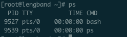
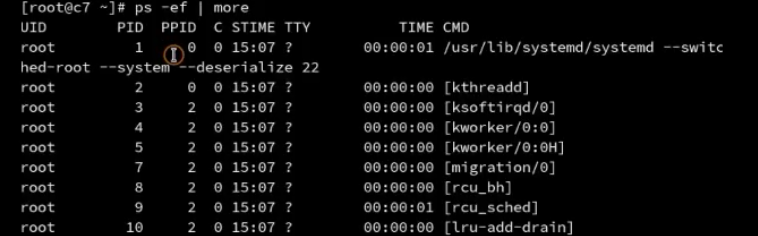
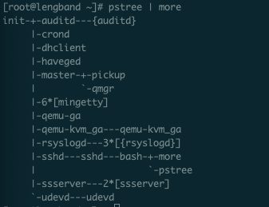
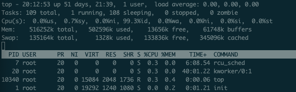
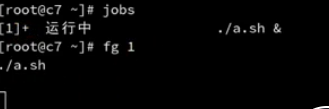
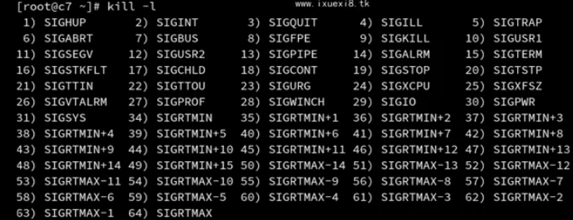

### 进程管理
##### 进程的概念与进程查看
###### 查看命令
**ps**（查看当前shell下面的进程，一般只有两条，如下）

PID 表示进程唯一标识、TTY 表示当前执行的终端（pts表示虚拟终端，纯字符界面会出现tty0、tty1...）、TIME 进程运行的时间（并无参考价值）
  * -e 查看其它shell下面的进程
  * -f 详细展示进程信息
  * -l 展示进程中的线程信息
  
  UID 有效启动进程用户、PID 表示进程唯一标识、PPID 表示父进程、
**pstree** 快速查看进程之间的层级关系
  

**top**
> 默认是每3秒更新一次，可以按 s 键然后输入 1，更改为 1 秒

49days：49天未关机
1 users：当前登录用户
load average：系统平均负载（最大值是1），1分钟 5分钟 15分钟 （数值递减表示系统越来越繁忙，递增反之）
Tasks：一共多少个进程在执行
Cpu(s)：上图表示 用户使用Cpu 0.0%，系统使用0.7%，99.3%的idle状态（空闲），wa表示等待磁盘IO操作，
> Cpus表示多个逻辑cpu的平均值，如果想看每一个的cpu可以按 1 键查看
Mem：总量 空闲量 使用量 处理缓存
Swap：同上
> Linux下叫交换分区，Windows下叫虚拟内存。当物理内存不够用时，把空闲内存交换出来。
> 结论: 
进程也是树形结构
进程和权限有着密不可分的关系

##### 进程的通信方式 - 信号
**进程的优先级调整**
* 调整优先级
  * nice 范围从-20到19，值越小优先级越高，抢占资源就越多 `eg：nice -n 10 ./a.sh`
  * renice 重新设置优先级(对正在运行的程序调整NI值) `eg：renice -n 10 <PID>`
* 进程的作业控制（进程的前后台切换）
> 快捷键ctrl+z能将当前运行进程挂起到后台（即是暂停程序运行，可以通过jobs恢复）
  * jobs(由后台程序转至前台运行吗，fg表示前台运行，bg表示后台运行)
  
  * &符号(进程由后台运行启动)（eg：`./a.sh &`）

**进程间通信**
> 信号是进程间通信的方式之一，典型用法是：终端用户驶入终端命令，通过信号机制停止一个进程的运行

使用信号的常见快捷键和命令
* kill -l 查看 kill 的命令
  
  * SIGINT 通知前台进程组终止进程 ctrl+c
  * SIGKILL 立即结束程序，不能被阻塞和处理 `kill -9 <pid>`

##### 守护进程和系统日志
##### 服务管理工具 systemstl
##### SELinux 简介
