# Linux安装
Linux是一种开源的操作系统，由于其免费，稳定，高效的特性，目前主要用作服务器。关于Linux的发展历史请读者自行查阅，基于Linux内核有几种主流的发行版：CentOS，Ubuntu，RedHat等。 
学习Linux，那么准备一个Linux的环境是必不可少的。

### 执行环境
> 我们常用的linux环境是以下三种的形式，那么这里推荐大家使用成本低、方便管理的虚拟机的方式。
1. 购买云服务器（阿里云、腾讯云、AWS..）
2. 无数据的PC（不推荐多系统混跑）
3. 虚拟机（推荐）

## VirtualBox
本文虚拟化工具选择是 VirtualBox。
那么为什么选择 VirtualBox 而不是 VMware workstation ？

1. 版权：virtualbox是免费软件，vmware workstion是商业软件
2. vbox 小巧，易于安装搭建环境
3. vbox的启动速度更快，适合学习场景

打开这个[下载地址](https://www.virtualbox.org/wiki/Downloads)，会看到这样的一个页面
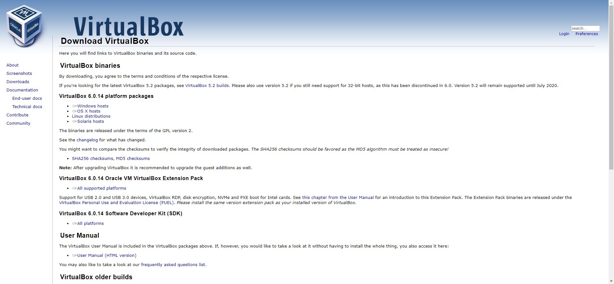
根据不同的操作系统选择不同的安装包，本文以windows安装包为例：

### 安装VirtualBox
首先会进入到和安装类似qq一样的界面，我们这里直接下一步直到完成就可以了。

### 新建VirtualBox
1. 首先先[下载镜像](http://mirrors.neusoft.edu.cn/centos/7.7.1908/isos/x86_64/), 本文选择的是 CentOS-7-x86_64-DVD-1908.iso，下载还比较大，大约4.5GB。(其中CentOS的Linux的发行版，7表示版本号，也是目前比较新且稳定的版本，后面的1980表示的是发行日期，2019年8月份。)
2. 打开之前安装好的vBox， 然后点击新建，输入名称, 如：centos7, 之后类型和版本会自动帮我们选择好，就不需要更改了，这里我还需要选择一个存放虚拟机的位置，这个随便选择，找一个空间充裕的地方。 
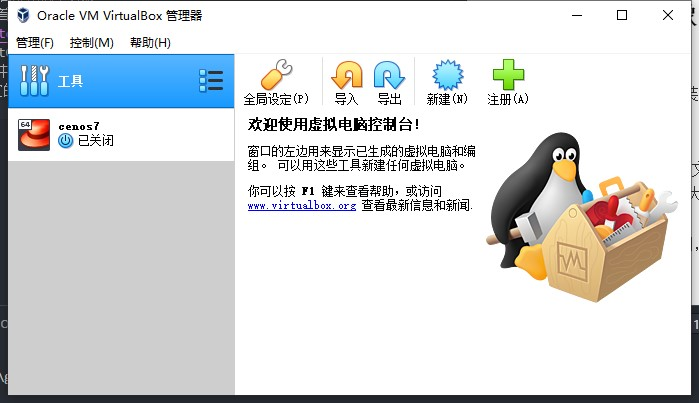

3. 选择内存 
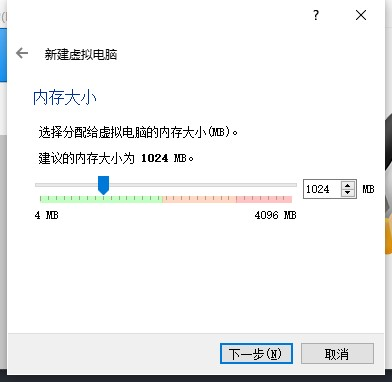

4. 虚拟磁盘 
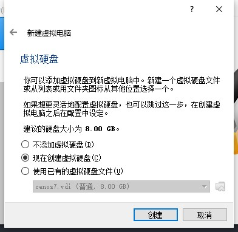

5. 虚拟磁盘文件类型 
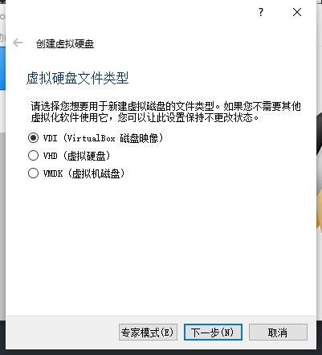

6. 存储在物理盘上，这里我们选择动态分配，动态分配指的是虚拟机占用了多少的磁盘空间，计算机就会给虚拟机分配多少磁盘，更加合理一些。 
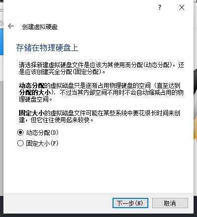

7. 最后是让你确认一下之前设置的一下选项，这里还可以进行更改，确认无误点击完成。（正常学习测试的话：3-6步可以直接下一步），最好我们点击创建。 
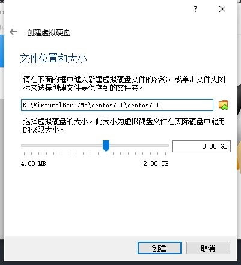

## 配置镜像
1. 打开设置 
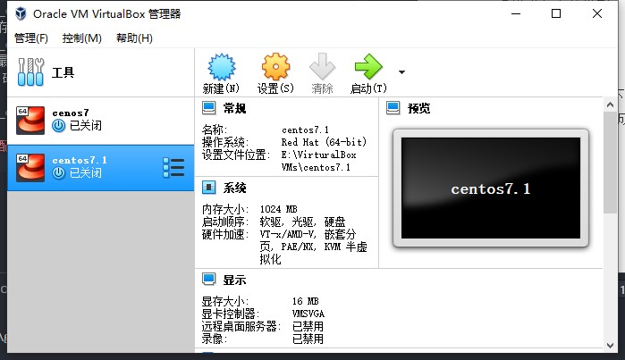

2. 点击存储，点击没有盘片，在点击分配光驱最右侧蓝色的光盘，选择我们刚刚下载的iso镜像，点击ok，这样配置镜像就完成了。 
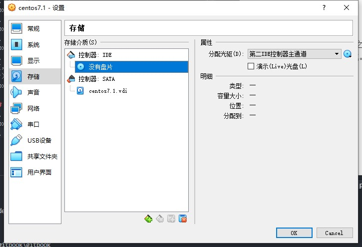

## 在虚拟机中安装Linux
1. 点击启动，出现一下界面，选择第一个 install CentOS 7。（第二个是表示的是测试这个镜像，第三个是故障排除） 
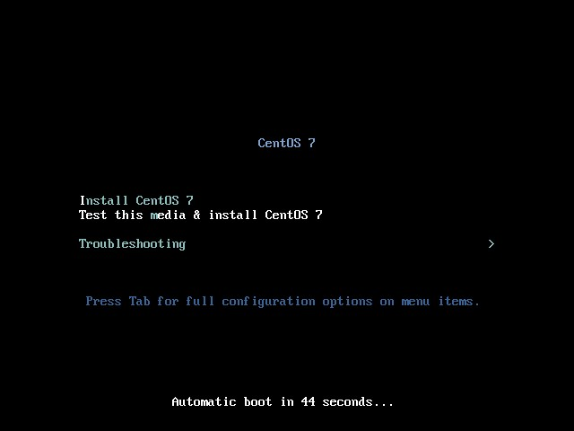

2. 经过一段时间等待，进入选择语言页面，这里我们选择中文。（这里的语言仅表示安装过程中的语言，并不会影响其他，所以这里我们选择 中文-简体中文） 

3. 这里先要等待灰色图标变为黑色(即安装完相应以来组件和数据)，然后确认你的安装位置，linux出于安全考虑，也会让我点磁盘分区确认，我们只需要自动分区即可，点击完成，点击开始安装。 
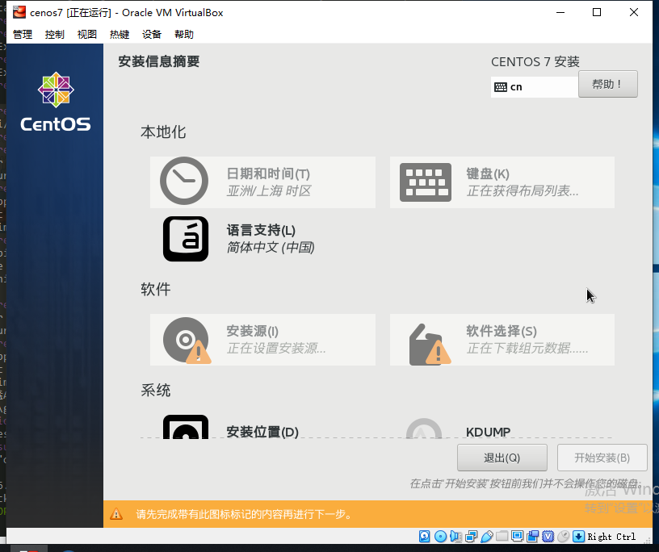
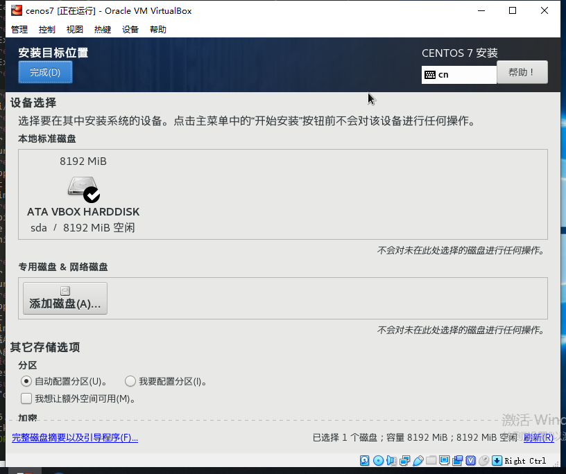

4. 安装完成之后进入到这个页面，下面有进度条，并且在此可以设置root密码和添加用户，如果是自己测试学习，那么设置root密码就够用了。等待进度条100%后，点击重启后，等待虚拟机系统重启完成。（时间会有点长） 
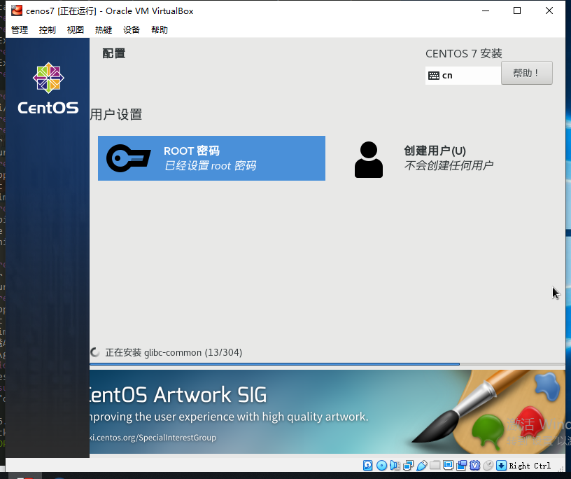

5. 进入这个页面，输入刚刚设置的用户和密码 
如：
root
123456
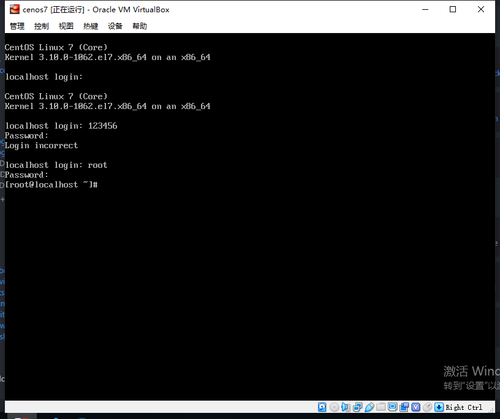

6. 最后就正式进入了Linux系统。 

